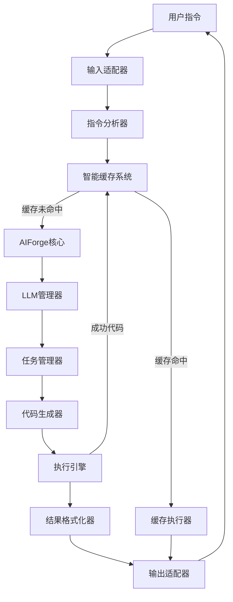

# 🔥 AIForge - 一句话指令，驱动 AI 编程本地执行 
  
<div align="center">  
  
[](https://www.python.org/) [](https://textual.textualize.io/) [](https://fastapi.tiangolo.com/) [](https://github.com/iniwap/AIForge) [](#) [](./LICENSE) [](https://github.com/iniwap/AIForge)  
  
**让AI直接编写并执行Python代码，释放大语言模型的真正潜能**  
  
[🚀 快速开始](#快速开始) • [📖 文档](#文档) • [🎯 功能特性](#功能特性) • [🛠️ 安装](#安装) • [💡 示例](#示例)  
  
</div>  
  
---  
  
## 🌟 什么是 AIForge？  
<div align="center">  

</div>

**AIForge** 是一个革命性的AI代码执行框架，通过大语言模型（LLM）将自然语言任务描述转化为可执行的 Python 代码，并在本地安全执行后返回结构化结果。它让大语言模型能够：    
- 🧠 **智能理解**任务需求并自动分析指令类型    
- 💻 **自动生成**高质量Python代码    
- ⚡ **实时执行**并获取结构化结果    
- 🔄 **自我修复**代码错误，支持多轮优化    
- 📊 **智能缓存**成功代码，提升执行效率  
- 🎯 **标准化指令**处理，支持复杂任务分解  
    
> **核心理念**: Code is Agent - 让AI通过代码直接与环境交互，无需复杂的工具链 
  
## 🎯 核心功能特性    
    
### ✨ 智能代码生成与执行  
- **标准化指令分析**: 自动分析用户指令，识别任务类型和参数  
- **多轮对话优化**: 支持最多5轮自动重试，直到获得满意结果    
- **智能Prompt系统**: 根据指令复杂度和任务类型自动选择最优提示策略  
- **代码质量保证**: 内置语法检查、结果验证和格式标准化机制    
    
### 🔧 强大的执行引擎    
- **安全执行环境**: 隔离的Python执行环境，预装常用数据处理库    
- **实时结果反馈**: 详细的执行日志、错误追踪和性能统计    
- **多执行器支持**: 支持函数式、数据处理、Web请求等多种执行策略  
- **结果格式化**: 自动格式化执行结果为标准JSON结构  
    
### 🧠 智能缓存系统  
- **标准化指令缓存**: 基于指令分析结果的智能代码复用  
- **模板模式匹配**: 支持参数化模板，提高代码复用率  
- **自动清理机制**: 基于成功率和使用频率的智能缓存管理  
- **代码质量验证**: 只缓存通过质量检查的功能代码  
    
### 🌐 多LLM提供商支持    
- **OpenRouter**: 模型聚合平台，支持多种模型（默认）  
- **DeepSeek**: 高性价比的国产模型，支持长上下文  
- **OpenAI**: GPT-3.5/GPT-4系列模型  
- **Ollama**: 本地模型部署支持  
- **懒加载架构**: 按需创建客户端，优化启动性能  
    
### 📈 实际应用场景    
- **数据分析**: 自动处理CSV、Excel、JSON等格式数据，生成分析报告  
- **网络爬虫**: 智能抓取网页内容，支持复杂选择器和数据提取  
- **API集成**: 自动调用各种Web API，处理认证和数据转换  
- **文件处理**: 批量处理文档、图片等文件，支持格式转换  
- **系统自动化**: 执行系统管理和运维任务，支持定时调度 
  
## 快速开始  
  
### 安装  
  
```bash  
pip install aiforge  
```  
  
### 基础使用  
  
#### 方式1：快速启动（推荐）  
```python  
from aiforge import AIForgeCore  
  
# 只需要API Key即可开始使用 
forge = AIForgeCore(api_key="your-openrouter-key")  
result = forge("获取今天的天气信息")  
print(result)  
```  
  
#### 方式2：指定提供商  
```python  
# 使用DeepSeek   
forge = AIForgeCore(  
    api_key="your-deepseek-key",   
    provider="deepseek",  
    max_rounds=3  
)  
result = forge("分析数据文件")  
```  
  
#### 方式3：配置文件方式  
```python  
# 使用配置文件  
forge = AIForgeCore(config_file="aiforge.toml")  
result = forge.run("处理任务", system_prompt="你是专业助手")  
```  
  
### 配置文件示例  
  
```toml  
workdir = "aiforge_work"  
max_tokens = 4096  
max_rounds = 5  
default_llm_provider = "openrouter"  
  
[llm.openrouter]  
type = "openai"  
model = "deepseek/deepseek-chat-v3-0324:free"  
api_key = "your-api-key"  
base_url = "https://openrouter.ai/api/v1"  
timeout = 30  
max_tokens = 8192  
  
[cache.code]  
enabled = true  
max_modules = 20  
failure_threshold = 0.8  
max_age_days = 30  
  
[optimization]  
enabled = false  
aggressive_minify = true  
max_feedback_length = 200  
```  

## API参考  
  
### AIForgeCore  
  
主要的核心类，提供代码生成和执行功能。  
  
```python  
class AIForgeCore:  
    def __init__(self,   
                 config_file: str | None = None,  
                 api_key: str | None = None,  
                 provider: str = "openrouter",  
                 **kwargs):  
        """  
        初始化AIForge核心  
          
        Args:  
            config_file: 配置文件路径（可选）  
            api_key: API密钥（快速启动模式）  
            provider: LLM提供商名称  
            **kwargs: 其他配置参数  
        """  
      
    def run(self, instruction: str,   
            system_prompt: str | None = None,   
            provider: str | None = None) -> Optional[Dict[str, Any]]:  
        """执行任务 - 统一入口"""  
      
    def __call__(self, instruction: str, **kwargs) -> Optional[Dict[str, Any]]:  
        """支持直接调用"""  
```  
  
### 执行参数说明  
  
- `instruction`: 自然语言任务描述  
- `system_prompt`: 可选的系统提示词，用于定制AI行为  
- `provider`: 可选的LLM提供商名称，用于临时切换模型  
  
## 高级功能  

### 智能缓存管理

```python
# 缓存会自动工作，也可以手动管理 
forge = AIForgeCore(api_key="your-key")  
  
# 执行任务，自动缓存成功的代码 
result1 = forge("分析sales.csv文件")  
  
# 相似任务会复用缓存的代码 
result2 = forge("分析products.csv文件")  # 复用缓存  
  
# 查看缓存统计  
if forge.code_cache:  
    print(f"缓存模块数: {len(forge.code_cache.get_all_modules())}")
```

### 自定义执行器  
```python  
from aiforge.execution.executor_interface import CachedModuleExecutor  
  
class CustomExecutor(CachedModuleExecutor):  
    def can_handle(self, module):  
        return hasattr(module, 'custom_function')  
      
    def execute(self, module, instruction, **kwargs):  
        return module.custom_function(instruction)  
  
forge.add_module_executor(CustomExecutor())  
```  
  
### 提供商切换  
```python  
# 运行时切换提供商 
forge.switch_provider("deepseek")  
  
# 查看可用提供商 
providers = forge.list_providers()  
print(providers)  
```  

### 多端输入适配
```python
# 支持多种输入源的适配 
result = forge.run_with_input_adaptation(  
    raw_input_x={"text": "分析数据", "context": "web"},  
    source="web",  
    context_data={"user_id": "123"}  
)
```

## 配置向导  
  
首次使用时，可以运行配置向导来快速设置：  
  
```python  
from aiforge.cli.wizard import create_config_wizard  
  
forge = create_config_wizard()  
```    
  
## 🏗️ 架构设计  
  

  
## 🔧 配置选项  
  
### 基础配置
| 基础配置项 | 说明 | 默认值 |  
|--------|------|--------|  
| `workdir` | 工作目录 | `"aiforge_work"` |  
| `max_rounds` | 最大重试轮数 | `5` |  
| `max_tokens` | 最大token数 | `4096` |  
| `default_llm_provider` | 默认LLM提供商 | `"openai"` |  

### 模型配置
| 模型配置项 | 说明 | 默认值 |  
|--------|------|--------|  
| `type` | 模型类型 | `"openai"` |  
| `model` | 模型 | `deepseek/deepseek-chat-v3-0324:free` |  
| `api_key` | API KEY | `` |  
| `base_url` | BASE URL | `https://openrouter.ai/api/v1` |    

### 缓存配置  
| 配置项 | 说明 | 默认值 |    
|--------|------|--------|    
| `enabled` | 是否启用缓存 | `true` |    
| `max_modules` | 最大缓存模块数 | `20` |    
| `failure_threshold` | 失败阈值 | `0.8` |    
| `max_age_days` | 最大缓存天数 | `30` |    
| `cleanup_interval` | 清理间隔 | `10` | 

## 🛣️ 未来发展路线图  

### 💡 当前版本功能（v1.0）
- ✅ 零配置启动 - 仅需API Key即可快速开始
- ✅ 多轮对话 - 支持代码生成、执行、调试的完整循环
- ✅ 智能缓存 - 基于标准化指令的智能代码复用系统
- ✅ 标准化指令 - 智能分析用户指令，支持复杂任务分解
- ✅ 多提供商支持 - 支持OpenRouter、DeepSeek、OpenAI、Ollama等
- ✅ 懒加载架构 - 按需创建客户端，优化启动性能
- ✅ 可扩展执行器 - 支持自定义模块执行策略
- ✅ 结果格式化 - 标准化JSON输出格式，支持多种UI适配
- ✅ **多端输入适配** - 支持Web、CLI、API等多种输入源的智能适配  
- ✅ **扩展系统** - 支持模板扩展和自定义执行器注册

### 🎯 近期计划 (v1.1 - v1.3)    
    
#### v1.1 - 增强执行能力    
- [ ] **多语言支持**: 支持JavaScript、Shell、SQL等代码执行    
- [ ] **包管理优化**: 自动检测并安装缺失的Python包    
- [ ] **内存管理**: 优化长时间运行的内存占用    
- [ ] **并发执行**: 支持多任务并行处理    
    
#### v1.2 - 智能化提升    
- [ ] **错误学习**: 从历史错误中学习，减少重复错误    
- [ ] **性能分析**: 内置代码性能分析和优化建议    
- [ ] **智能调试**: AI辅助的代码调试和错误修复    
- [ ] **预测执行**: 基于历史数据预测任务执行结果  
    
#### v1.3 - 生态扩展    
- [ ] **插件系统**: 支持第三方插件扩展功能    
- [ ] **模板库**: 内置常用任务模板，快速启动项目    
- [ ] **API服务**: 提供REST API，支持远程调用    
- [ ] **Web界面**: 基于Web的可视化操作界面    
    
### 🚀 中期愿景 (v2.0 - v2.5)    
    
#### v2.0 - 多模态集成    
- [ ] **图像处理**: 集成计算机视觉能力，处理图片和视频    
- [ ] **语音交互**: 支持语音输入和输出    
- [ ] **文档理解**: 智能解析PDF、Word等文档格式    
- [ ] **数据可视化**: 自动生成图表和可视化报告    
    
#### v2.1 - 企业级功能    
- [ ] **权限管理**: 多用户权限控制和资源隔离    
- [ ] **审计日志**: 完整的操作审计和合规支持    
- [ ] **集群部署**: 支持分布式部署和负载均衡    
- [ ] **监控告警**: 实时监控和异常告警系统    
    
#### v2.2 - AI Agent生态    
- [ ] **Agent协作**: 多个AI Agent协同完成复杂任务    
- [ ] **工作流引擎**: 可视化工作流设计和执行    
- [ ] **知识库集成**: 企业知识库和文档检索    
- [ ] **决策支持**: 基于数据的智能决策建议    
    
### 🌟 长期目标 (v3.0+)    
    
#### v3.0 - 通用AI平台    
- [ ] **自然语言编程**: 完全基于自然语言的编程体验    
- [ ] **跨平台部署**: 支持云端、边缘、移动端部署    
- [ ] **行业解决方案**: 针对金融、医疗、教育等行业的专业方案    
- [ ] **AI模型训练**: 支持自定义AI模型训练和部署    
    
#### 🎨 创新功能展望    
- [ ] **代码进化**: AI自动优化和重构历史代码    
- [ ] **智能推荐**: 根据用户习惯推荐相关功能和优化建议    
- [ ] **自适应学习**: 系统根据使用情况自动调整和优化    
- [ ] **量子计算集成**: 支持量子计算任务的代码生成和执行
  
## 🤝 贡献指南  
  
我们欢迎所有形式的贡献！  
  
### 如何贡献  
1. Fork 本仓库  
2. 创建功能分支 (`git checkout -b feature/AmazingFeature`)  
3. 提交更改 (`git commit -m 'Add some AmazingFeature'`)  
4. 推送到分支 (`git push origin feature/AmazingFeature`)  
5. 创建 Pull Request  
  
### 开发环境设置  
```bash  
git clone https://github.com/iniwap/AIForge.git  
cd AIForge  
pip install -e ".[dev]"  
pytest tests/  
```  
  
## 📄 许可证  
  
本项目采用 Apache 2.0 许可证 - 查看 [LICENSE](LICENSE) 文件了解详情  
  
## 🙏 致谢  
  
- 感谢 ChatGPT、Grok、Gemini等
- 感谢所有贡献者和社区支持  
  
## 📞 联系我们  
  
- 📧 Email: iniwaper@iniwaper.com  
- 💬 Discord: [加入我们的社区](https://discord.gg/AIForge)  
- 🐦 Twitter: [@AIForge](https://twitter.com/iafun_tipixel)  
- 📚 文档: [查看完整文档](https://aiforge.readthedocs.io)  
    
---    
    
<div align="center">    
    
**⭐ 如果这个项目对你有帮助，请给我们一个星标！**    
    
[立即开始使用 AIForge](https://github.com/iniwap/AIForge) | [查看更多示例](https://github.com/iniwap/AIForge/tree/main/examples) | [贡献代码](https://github.com/iniwap/AIForge/blob/main/CONTRIBUTING.md)  
    
Made with ❤️ by the AIForge Team  
    
</div>
