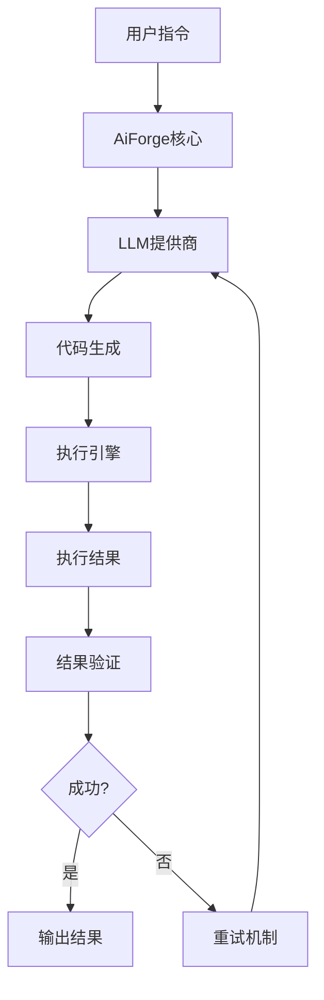

# 🔥 AiForge - 一句话指令，驱动 AI 编程本地执行 
  
<div align="center">  
  
[](./LICENSE) [](https://www.python.org/) [](https://github.com/iniwap/aiforge) [](#)[](https://github.com/iniwap/aiforge)  
  
**让AI直接编写并执行Python代码，释放大语言模型的真正潜能**  
  
[🚀 快速开始](#快速开始) • [📖 文档](#文档) • [🎯 功能特性](#功能特性) • [🛠️ 安装](#安装) • [💡 示例](#示例)  
  
</div>  
  
---  
  
## 🌟 什么是 AiForge？  
**AIForge** 是一个任务驱动的 AI 编程引擎，通过大语言模型（LLM）将自然语言任务描述转化为可执行的 Python 代码，并在本地执行后返回结果。无需手动编程，即可自动完成数据处理、可视化、API 调用等一系列操作。**AiForge** 是一个革命性的AI代码执行框架，它让大语言模型能够：  
- 🧠 **智能理解**任务需求  
- 💻 **自动生成**Python代码  
- ⚡ **实时执行**并获取结果  
- 🔄 **自我修复**代码错误  
- 📊 **持续优化**执行策略  
  
> **核心理念**: Code is Agent - 让AI通过代码直接与环境交互，无需复杂的工具链  
  
## 🎯 核心功能特性  
  
### ✨ 智能代码生成  
- **多轮对话优化**: 支持自定义轮次自动重试，直到获得满意结果  
- **智能Prompt系统**: 根据指令复杂度自动选择合适的系统提示  
- **代码质量保证**: 内置语法检查和预处理机制  
  
### 🔧 强大的执行引擎  
- **安全执行环境**: 隔离的Python执行环境，预装常用库  
- **实时结果反馈**: 详细的执行日志和错误追踪  
- **状态持久化**: 跨执行保持变量状态  
  
### 🌐 多LLM提供商支持  
- **OpenAI**: GPT-3.5/GPT-4系列  
- **DeepSeek**: 高性价比的国产模型  
- **OpenRouter**: 模型聚合平台，多种模型可选  
- **Ollama**: 本地模型部署  
- **更多提供商**: 持续扩展中...  
  
### 📈 实际应用场景  
- **数据分析**: 自动处理CSV、Excel、JSON等格式数据  
- **网络爬虫**: 智能抓取网页内容和结构化数据  
- **API集成**: 自动调用各种Web API获取信息  
- **文件处理**: 批量处理文档、图片等文件  
- **系统自动化**: 执行系统管理和运维任务  
  
## 🚀 快速开始  
  
### 安装  
  
```bash  
pip install aiforge  
```  
  
### 基础配置  
  
创建 `aiforge.toml` 配置文件：  
  
```toml  
workdir = "aiforge_work"  
record = true  
max_tokens = 4096  
max_rounds = 5  
default_llm_provider = "openai"  
  
[llm.openai]  
type = "openai"  
model = "gpt-4"  
api_key = "your-api-key-here"  
enable = true  
default = true  
timeout = 30  
max_tokens = 8192  
```  
  
### 基本使用  
  
```python  
from aiforge import AiForgeCore  
  
# 初始化AiForge  
forge = AiForgeCore("aiforge.toml")  
  
# 简单任务 - AI会自动生成并执行代码  
result = forge.generate_and_execute("获取今天的天气信息")  
  
# 复杂任务 - 详细的技术指令  
search_instruction = """  
请生成一个搜索函数，获取最新新闻：  
1. 使用requests和BeautifulSoup  
2. 支持多个搜索引擎  
3. 返回JSON格式结果  
4. 包含标题、链接、摘要、发布时间  
"""  
result = forge.generate_and_execute(search_instruction)  
```  
  
## 💡 使用示例  
  
### 数据分析示例  
```python  
# AI会自动生成pandas代码分析数据  
result = forge.generate_and_execute("""  
分析sales.csv文件：  
1. 计算每月销售总额  
2. 找出销售额最高的产品  
3. 生成可视化图表  
""")  
```  
  
### 网络爬虫示例  
```python  
# AI会自动生成爬虫代码  
result = forge.generate_and_execute("""  
爬取新闻网站首页：  
1. 获取所有新闻标题和链接  
2. 提取发布时间  
3. 按时间排序返回最新10条  
""")  
```  
  
## 🏗️ 架构设计  
  

  
## 🔧 配置选项  
  
| 基础配置项 | 说明 | 默认值 |  
|--------|------|--------|  
| `workdir` | 工作目录 | `"aiforge_work"` |  
| `max_rounds` | 最大重试轮数 | `5` |  
| `max_tokens` | 最大token数 | `4096` |  
| `default_llm_provider` | 默认LLM提供商 | `"openai"` |  

| 模型配置项 | 说明 | 默认值 |  
|--------|------|--------|  
| `type` | 模型类型 | `"openai"` |  
| `model` | 模型 | `deepseek/deepseek-chat-v3-0324:free` |  
| `api_key` | API KEY | `` |  
| `base_url` | BASE URL | `https://openrouter.ai/api/v1` |    


## 🛣️ 未来发展路线图  
  
### 🎯 近期计划 (v1.1 - v1.3)  
  
#### v1.1 - 增强执行能力  
- [ ] **多语言支持**: 支持JavaScript、Shell、SQL等代码执行  
- [ ] **包管理优化**: 自动检测并安装缺失的Python包  
- [ ] **内存管理**: 优化长时间运行的内存占用  
- [ ] **并发执行**: 支持多任务并行处理  
  
#### v1.2 - 智能化提升  
- [ ] **代码缓存**: 智能缓存常用代码片段，提升执行效率  
- [ ] **错误学习**: 从历史错误中学习，减少重复错误  
- [ ] **性能分析**: 内置代码性能分析和优化建议  
- [ ] **智能调试**: AI辅助的代码调试和错误修复  
  
#### v1.3 - 生态扩展  
- [ ] **插件系统**: 支持第三方插件扩展功能  
- [ ] **模板库**: 内置常用任务模板，快速启动项目  
- [ ] **API服务**: 提供REST API，支持远程调用  
- [ ] **Web界面**: 基于Web的可视化操作界面  
  
### 🚀 中期愿景 (v2.0 - v2.5)  
  
#### v2.0 - 多模态集成  
- [ ] **图像处理**: 集成计算机视觉能力，处理图片和视频  
- [ ] **语音交互**: 支持语音输入和输出  
- [ ] **文档理解**: 智能解析PDF、Word等文档格式  
- [ ] **数据可视化**: 自动生成图表和可视化报告  
  
#### v2.1 - 企业级功能  
- [ ] **权限管理**: 多用户权限控制和资源隔离  
- [ ] **审计日志**: 完整的操作审计和合规支持  
- [ ] **集群部署**: 支持分布式部署和负载均衡  
- [ ] **监控告警**: 实时监控和异常告警系统  
  
#### v2.2 - AI Agent生态  
- [ ] **Agent协作**: 多个AI Agent协同完成复杂任务  
- [ ] **工作流引擎**: 可视化工作流设计和执行  
- [ ] **知识库集成**: 企业知识库和文档检索  
- [ ] **决策支持**: 基于数据的智能决策建议  
  
### 🌟 长期目标 (v3.0+)  
  
#### v3.0 - 通用AI平台  
- [ ] **自然语言编程**: 完全基于自然语言的编程体验  
- [ ] **跨平台部署**: 支持云端、边缘、移动端部署  
- [ ] **行业解决方案**: 针对金融、医疗、教育等行业的专业方案  
- [ ] **AI模型训练**: 支持自定义AI模型训练和部署  
  
#### 🎨 创新功能展望  
- [ ] **代码进化**: AI自动优化和重构历史代码  
- [ ] **预测执行**: 基于历史数据预测任务执行结果  
- [ ] **智能推荐**: 根据用户习惯推荐相关功能和优化建议  
- [ ] **自适应学习**: 系统根据使用情况自动调整和优化  
  
## 🤝 贡献指南  
  
我们欢迎所有形式的贡献！  
  
### 如何贡献  
1. Fork 本仓库  
2. 创建功能分支 (`git checkout -b feature/AmazingFeature`)  
3. 提交更改 (`git commit -m 'Add some AmazingFeature'`)  
4. 推送到分支 (`git push origin feature/AmazingFeature`)  
5. 创建 Pull Request  
  
### 开发环境设置  
```bash  
git clone https://github.com/iniwap/aiforge.git  
cd aiforge  
pip install -e ".[dev]"  
pytest tests/  
```  
  
## 📄 许可证  
  
本项目采用 Apache 2.0 许可证 - 查看 [LICENSE](LICENSE) 文件了解详情  
  
## 🙏 致谢  
  
- 感谢 ChatGPT、Grok、Gemini等
- 感谢所有贡献者和社区支持  
  
## 📞 联系我们  
  
- 📧 Email: iniwaper@iniwaper.com  
- 💬 Discord: [加入我们的社区](https://discord.gg/aiforge)  
- 🐦 Twitter: [@AiForge](https://twitter.com/aiforge)  
  
---  
  
<div align="center">  
  
**⭐ 如果这个项目对你有帮助，请给我们一个星标！**  
  
[立即开始使用 AiForge](https://github.com/iniwap/aiforge) | [查看更多示例](https://github.com/iniwap/aiforge/tree/main/examples)  
  
</div>